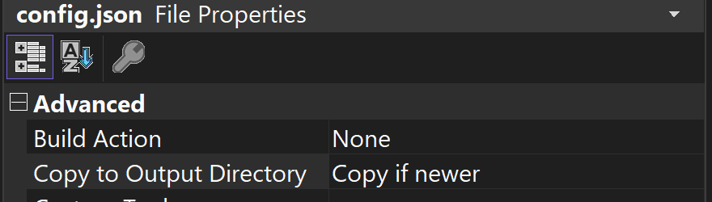
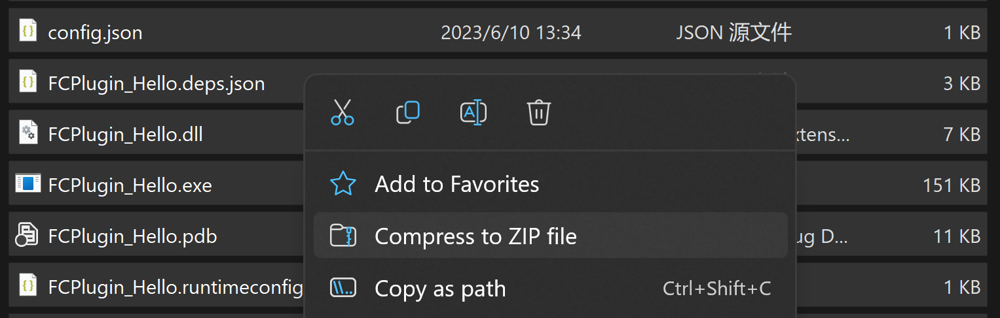
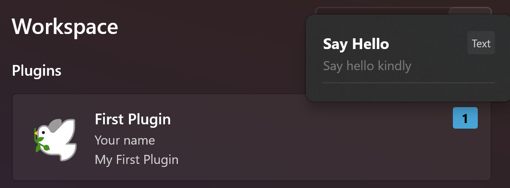
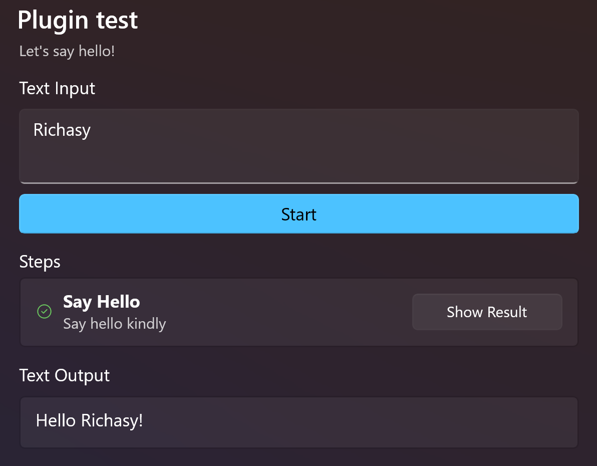

## What is a plugin?

For Fantasy Copilot, a plugin is a set of commands. The commands provided by the plugin can be embedded into the current workflow, enabling highly flexible automation operations.

## The process of writing a plugin

***You can use any language you like to write a plugin, as long as the language can be compiled into a 64-bit executable file for the Windows platform.***

1. Create a command-line program that can receive parameters.
2. Receive the `Input` parameter within the program and use the incoming value to do something.
3. Print the final result on the console.
4. Create a `config.json` file for simple configuration.
5. Build the application, package the compiled executable file, `config.json`, and dependencies into a zip file.
6. Change the file extension of the compressed package to `.fcpkg`.
7. The plugin is now created.

It's that simple. The application is only responsible for execution, passing in values, and retrieving the text you print on the console. Therefore, theoretically, you can use any programming language to build a plugin.

However, some languages rely on a runtime environment (such as Python), in which case you may need to build a `self-contained` application to avoid your plugin from failing to run on other people's devices.

## Starting with `Hello`

Next, we will build a simple plugin that receives external input and greets the user.

*C# is my most familiar language, so I will use C# for the following steps, but you can try using your own familiar language.*

### Creating a Console Application

Obviously, this article will not teach you how to create a C# console application. If you are new to C# and want to follow this tutorial, you can refer to this document to create a blank console application: [Tutorial: Create a simple C# console app in Visual Studio](https://learn.microsoft.com/en-us/visualstudio/get-started/csharp/tutorial-console?view=vs-2022)

Now, assuming you already know how to create a C# console application, let's create a blank console application and name it `FCPlugin_Hello`.

### Receiving External Input

As a step in the workflow, we need to receive values from external sources. Assuming that your compiled executable is named `FCPlugin_Hello.exe`, the application will be called in the following way when attempting to execute the plugin:

```powershell
FCPlugin_Hello.exe -Input "The result of the previous step" ...
```

Therefore, when writing the plugin, we need to obtain external input through parameters.

You can either write your own parameter parsing tool or use an existing library. We will use [System.CommandLine](https://www.nuget.org/packages/System.CommandLine/) as an example.

1. Import [System.CommandLine](https://www.nuget.org/packages/System.CommandLine/) in Nuget Package Manager.
2. Enter the following code in `Program.cs`:

> This code is based on .NET 7 and uses top-level statements. Therefore, you won't see the `Program` class definition and `Main` function. For more details, please refer to [Tutorial: Explore ideas using top-level statements to build code as you learn](https://learn.microsoft.com/en-us/dotnet/csharp/whats-new/tutorials/top-level-statements).

```csharp
using System.CommandLine;

var inputOption = new Option<string?>("-Input");
var rootCommand = new RootCommand
{
    inputOption,
};

rootCommand.SetHandler(
    input =>
    {
        Console.WriteLine($"Hello {input ?? "Anonymous"}!");
    },
    inputOption);

return await rootCommand.InvokeAsync(args);
```

Let's break down this code:

1. We use `new Option<string?>("-Input")` to construct a parameter parser that parses the `-Input` parameter and outputs its value as a `string?`. 
2. We create a `RootCommand`, which serves as the entry point for our functionality. It will retrieve the parameters and execute the handler. So we pass the previously constructed parameter option to it. 
3. Now that we have the parameters, we can add a handler. We call `rootCommand.SetHandler` and pass in our handler and the corresponding parameter parser. 
4. In the handler, once we receive the `Input`, we print it to the console and say hello. 
5. Finally, we run `rootCommand` and wait for it to handle the invocation.

### Building Applications

How can I obtain an executable file?

One of the simplest ways is to build the application.

In the Visual Studio top menu bar, set the build configuration to Release | x64.


Right-click on your project, select "Build", and wait for the build to complete. You can then open the project directory and follow the path below to find your built program:

`{YOUR_PROJECT_FOLDER}\bin\Release\{net_version}`

Assuming you built the `FCPlugin_Hello` application using .Net 7, your build directory path should look like this:

`FCPlugin_Hello\bin\Release\net7.0\`

You can find the executable file named `FCPlugin_Hello.exe` in this directory.

### Creating a Configuration File

Fantasy Copilot obviously cannot decompile your executable file, so you still need to write a configuration file to tell the application how to run your program.

Add a new JSON file to your project and name it `config.json`. Right-click on it, select `Properties`, and set it up as shown in the image below (copy to output directory if newer):



Then copy and paste the following JSON into your `config.json`.

```json
{
  "schema_version": 1,
  "package_name": "First Plugin",
  "package_desc": "My First Plugin",
  "package_id": "com.test.hello",
  "version": "0.0.1",
  "author": "Your name",
  "repository": "https://github.com/",
  "commands":[
    {
        "command_name": "Say Hello",
        "command_desc": "Say hello kindly",
        "command_id": "3701C734-E489-4730-8BA8-454D8438B02D",
        "category": "text",
        "only_final_output": true,
        "execute_name": "FCPlugin_Hello.exe",
        "output":{
            "type":"plain"
        }
    }
  ]
}
```

After rebuilding your project, you will notice that a `config.json` file appears in the output directory.

We won't go into the specific meaning of this JSON file for now. When you are ready to write your own plugin, please refer to this document: [[Plugin Configuration]].

However, it is important to note that each `command_id` should be a unique GUID. The GUID provided in the example above is for reference only, and you should generate a new GUID when writing your own plugin.

### Packaging

Packaging is very simple. Go to the output directory, select all files, and then compress them into a zip file.



Rename the generated file to `FCPlugin_Hello.fcpkg`, and then copy it to the desktop.

***Note that when renaming, you need to modify the file extension as well, not just the file name!***

### Importing Plugins

1. Open Fantasy Copilot.
2. Go to the workspace page and select the "Plugins" tab.
3. Click on the import button in the upper right corner, select the `FCPlugin_Hello.fcpkg` file located on your desktop, and confirm.

Once the plugin is successfully imported, you will see it appear in the list of plugins. 🎊



### Try it!

Let's try building a new workflow.

When adding steps, you can find your `Say Hello` command under the Text directory. Let's use it to try some simple input and output.



Congratulations! You have created a custom plugin!