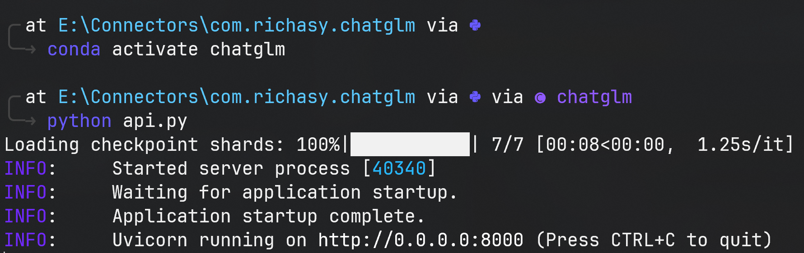
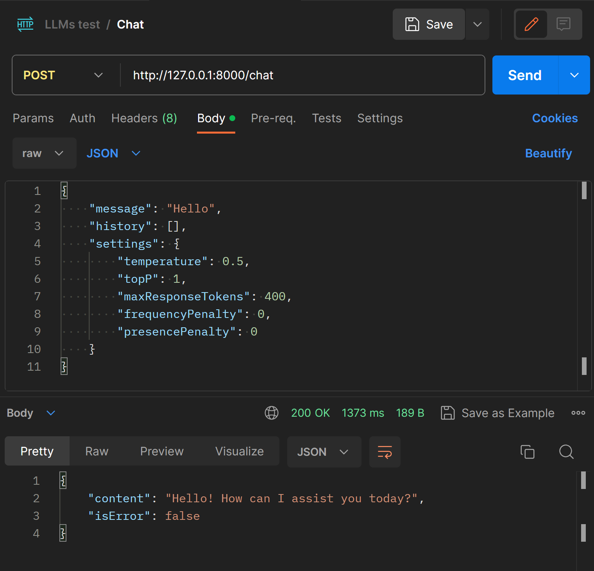
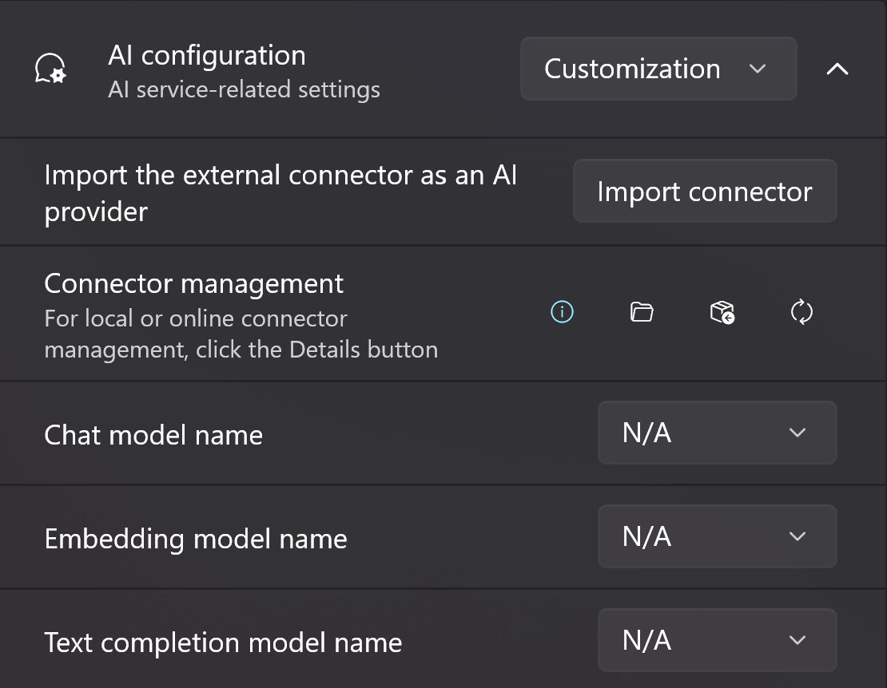
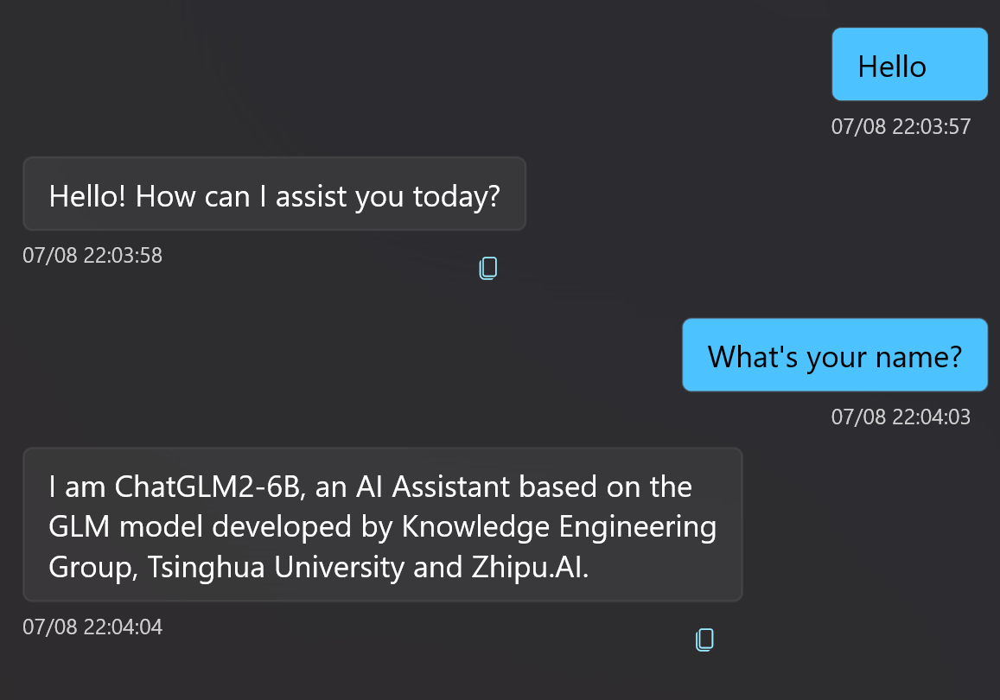

## What is a Connector?

We always need an interface to interact with the large language model, and this interface is the connector. The application natively supports Open AI/Azure Open AI, which provides an online service interface, so the application has built-in Open AI and Azure Open AI connectors.

## Why do we need a custom connector?

Models are not private to Open AI, and the open source community is developing at a speed beyond imagination. If you want to integrate open source models into your application, then you need a custom connector.

You can write your own connector, believe me, if you have already deployed models locally, then writing a custom connector will be very simple!

## Running process

The custom connector is a plug-in, an API server running locally.

Its process is as follows:

1. Application startup
2. Run executable or script
3. Start API server
4. Interact through API
5. Close application and close API service

## Quick Start

> I'm sorry to say that this article won't teach you how to deploy a certain large language model, because there are too many kinds of models.  
> So this article assumes that you have already deployed a model and it is running locally.  
> This means that you may have already installed `cuda`, `pytorch`` and other common libraries, and configured the python runtime environment, and have some understanding of how to run large language models.  
> But if you don't know these, please try to find tutorials first and then try it after setting up the running environment.

Let's take [ChatGLM2-6B](https://github.com/THUDM/ChatGLM2-6B) as our chat model, and Python as our development language due to the current community environment.

### Clone Repository and Environment Setup

If you have already deployed ChatGLM2-6B locally, please skip this step.

After cloning [ChatGLM2-6B](https://github.com/THUDM/ChatGLM2-6B), if you have `conda`, please create an environment first:

```bash
conda create -n chatglm
```

Then follow [Getting Started](https://github.com/THUDM/ChatGLM2-6B/blob/main/README_EN.md#getting-started) to install dependencies and set up the environment.

### Creating an API Service

The repository `ChatGLM2-6B` contains an [api.py](https://github.com/THUDM/ChatGLM2-6B/blob/main/api.py) which provides us with a good example of how to build an API service using Python.

We will rewrite the code to make it suitable for Fantasy Copilot.

#### 1. Deleting Old Code

Delete the code related to the endpoint `@app.post("/")` in `api.py`.

#### 2. Download and Replace the Model

For testing, we choose the quantized model: [THUDM/chatglm2-6b-int4](https://huggingface.co/THUDM/chatglm2-6b-int4)

Clone the entire repository to your local machine, then create a `model` folder in the **ChatGLM2-6B** project directory and put all the files from the downloaded model repository into the `model` folder.

> If you have installed Git LFS, you can switch to the ChatGLM2-6B project directory in the terminal and run:  
> `git lfs install`  
> `git clone https://huggingface.co/THUDM/chatglm2-6b-int4`  
> Then rename the `chatglm2-6b-int64` folder in the project directory to `model`

We choose to download the model instead of the default cached model for future persistent running.

> There is a bug in ChatGLM2-6B-INT4 on Windows, please refer to [ChatGLM-6B model fine-tuning error](https://github.com/THUDM/ChatGLM-6B/issues/967) for details, and you need to make corresponding modifications. But if you use the unquantized model, no modification is required.

After the model is downloaded, please change the code at the bottom of `api.py` to:

```python
if __name__ == '__main__':
    tokenizer = AutoTokenizer.from_pretrained("model", trust_remote_code=True, revision="")
    model = AutoModel.from_pretrained("model", trust_remote_code=True, revision="").half().cuda()
    model.eval()
    uvicorn.run(app, host='0.0.0.0', port=8000, workers=1)
```

#### 3. Define Types

Since custom connectors are actually an API service, Fantasy Copilot will send data to the connector via Http and receive a response.

Therefore, both the request and response should have the same data structure, here is the definition in Python:

```python
from pydantic import BaseModel

class Message(BaseModel):
    role: str
    content: str

class RequestSettings(BaseModel):
    temperature: float
    maxResponseTokens: int
    topP: float
    frequencyPenalty: float
    presencePenalty: float

class CopilotChatRequest(BaseModel):
    message: str
    history: List[Message]
    settings: RequestSettings

class CopilotTextRequest(BaseModel):
    message: str
    settings: RequestSettings

class CopilotMessageResponse(BaseModel):
    content: str
    isError: bool
```

Please write the type definitions in this part in `api.py`

#### 4. Defining a Chat Endpoint

Now that we have the basic data types, let's define an API endpoint for a chat!

```python
@app.post("/chat", response_model=CopilotMessageResponse)
async def chat_response(request: CopilotChatRequest):
    global model, tokenizer
    model_history = convert_to_string_array(request.history)
    model_max_length = request.settings.maxResponseTokens
    model_top_p = request.settings.topP if request.settings.topP else 0.7
    model_temperature = request.settings.temperature if request.settings.temperature else 0.95
    try:
        response, history = model.chat(tokenizer,
                                    request.message,
                                    history=model_history,
                                    max_length=model_max_length,
                                    top_p=model_top_p,
                                    temperature=model_temperature)
        answer = CopilotMessageResponse(content=response, isError=False)
    except Exception as ex:
        answer = CopilotMessageResponse(content=str(ex), isError=True)
    torch_gc()
    return answer
```

In this code snippet, we first convert the request into a `CopilotChatRequest` in the parameters, which contains the user input message, history records, and session parameters.

Since the history records passed in by Fantasy Copilot may not be the type of history records required by the model, we use `convert_to_string_array` to convert the incoming history records into a string array required by the model.

Here is the full definition of the method:

```python
def convert_to_string_array(message_list: List[Message]) -> List[tuple[str, str]]:
    string_array = []
    if message_list:
        first_item = message_list[0]
        if first_item.role == 'System':
            string_array.append((first_item.content, 'OK'))
            message_list.pop(0)
    for i in range(0, len(message_list) - 1, 2):
        user_message = message_list[i]
        assistant_message = message_list[i+1]
        user_content = user_message.content if user_message else ""
        assistant_content = assistant_message.content if assistant_message else ""

        string_array.append((user_content, assistant_content))
    return string_array
```

According to the model you are using, you can adjust the transformation code yourself. `ChatGLM` requires the history record to be in the form of `[["Question", "Answer"],["Question", "Answer"]]`, so here we will split the incoming history record into pairs of string arrays. 

Next is some general variable transformation, we need to convert the incoming session settings into the parameters required by the model. 

Then call the model's `chat` method to get the model's response. 

Finally, we convert the response into `CopilotMessageResponse` and return it. 

It should be noted that the model may encounter errors (such as exceeding the token window or other runtime exceptions) during the process of generating the response, so the necessary try-catch helps us understand the cause of the error and allows Fantasy Copilot to display the corresponding error UI.

#### 5. Running and Testing

Now that we have an endpoint, it's time to run the API service!

Open your terminal, navigate to the project directory, and then run `python api.py`.



If you see the result like the picture above, it means that the API has been successfully started and there is no error, which is great!

However, for safety's sake, we can use an API testing tool (such as `Postman`) to test whether the `/chat` endpoint is working.

In `Postman`, build a POST request and try the following request body:

```json
{
    "message": "Hello",
    "history": [],
    "settings": {
        "temperature": 0.5,
        "topP": 1,
        "maxResponseTokens": 400,
        "frequencyPenalty": 0,
        "presencePenalty": 0
    }
}
```

If all goes well, you should see the following response in the image below:



This means that our API service has been successfully built!

#### 6. Writing the Connector Manifest File

In order to tell Fantasy Copilot how to properly use this connector, you need to create a `connector.json` in the project root directory and use it to define your connector.

Here is an example:

```json
{
    "id": "com.yourname.chatglm",
    "name": "ChatGLM2-6B",
    "base_url": "http://127.0.0.1:8000",
    "script_command": "python api.py",
    "features": [
        {
            "type": "chat",
            "endpoints": [
                {
                    "type": "chat-rest",
                    "path": "/chat"
                }
            ]
        }
    ]
}
```

We give our connector a unique ID and a name (this `name` will be displayed in the Fantasy Copilot UI), and define the API url. 

`script_command` is an attribute that needs to be highlighted. Custom connectors support multiple activation methods, in addition to `script_command`, you can also activate it through `script_file`, `execute_name`. You may want to learn more about it in [[Connector Configuration]].

In `features`, we define that our connector supports `chat`, in addition to `chat`, you can also support `text-completion` and `embedding`, you can see how to support them in [Custom connector examples](https://github.com/Richasy/FantasyCopilot/tree/main/examples/custom-connector).

Finally, we add the `/chat` endpoint, `chat` supports three endpoint types:

- `chat-rest`: After sending the request, get a full text response.
- `chat-stream`: After sending the request, return a streaming response in SSE (Server-Send Events) mode (typewriter mode).
- `chat-stream-cancel`: End the generation process of `chat-stream` in advance.

#### 7. Packaging and Importing

Now we have a folder with our `api.py`, `connector.json` and model folder `model`.

Next is how to import it into Fantasy Copilot.

First, select all the files in the project directory, right-click, select `Compress to ZIP file`, or use other tools you are used to, to package all the files in the project directory into a zip file.

Then we modify the extension of this file to `fctor`.

Then we open Fantasy Copilot, enter the settings page, switch the AI configuration to `Custom`, and expand the settings.



**You may have seen the button `Import connector`, but please don't click it yet!**

Since our compressed package contains model files, it takes up a lot of space.

**Import** essentially means unzipping the connector to the connector directory, which by default is located in the application root directory in the system disk.

I strongly suggest that you change the connector directory before importing the connector, which has the following benefits:

1. Facilitates future modifications
2. Allows you to use a larger hard disk to store, avoiding occupying the space of the system disk
3. If you decide to uninstall the application, at least the connector directory will not be deleted

In the `Connector management` option, click the third button `Change the folder`, and select a suitable connector directory.

Then click `Import Connector`, and in the pop-up file selector, select the `fctor` file we just created.

Wait for the import to complete, and then you can find the conversation model we just imported in the `Chat model name`!

#### 8. Start new session

Now, switch to the session page and start chatting with ChatGLM2-6B!


