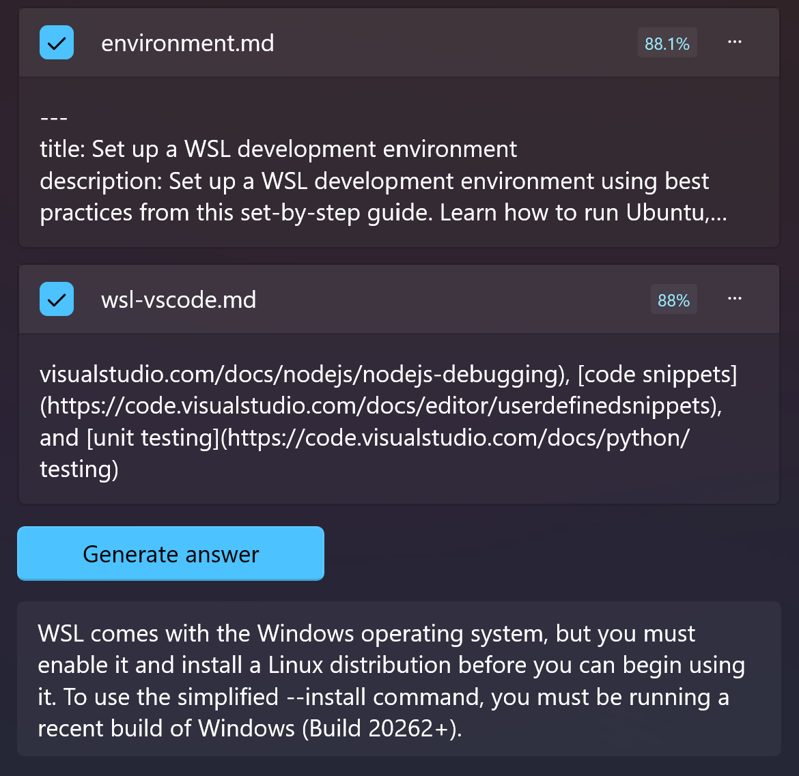

## Why create a knowledge base?

I'm sure you've read a lot of documents, from short tweets to textbooks with millions of words. How much do you remember now?

We all have the feeling of "deja vu", but we often can't recall the details. Sometimes, our memory can deceive us.

Initially, a knowledge base was like a library, recording what we have read and searching by keywords. However, as the number of documents stored increases, searching becomes more difficult, and most knowledge becomes like mud in a pond - it exists, but it's hard to see through.

The emergence of large language models has changed this situation.

We can convert existing document libraries into vector storage.

Once converted into vectors, we can do one thing - semantic search.

Imagine this scenario:

You want to find something, you have a rough idea, and you know it exists in your knowledge base, but you forgot the keyword.

In the past, once you forgot the keyword, it was difficult to locate the specific document.

But now, you can describe your impression directly, such as "related to xxx" or "similar to xxx".

The model can understand what you are saying and quickly locate relevant documents!

This sounds amazing, but there is another amazing thing.

That is cross-language queries.

Imagine that you can't read English, but you have a thick manual about a certain appliance, and it's all in English. Do you feel hopeless?

But now, let's import them all into the knowledge base! Next, you can ask questions in your native language.

The amazing thing is that it can also understand and locate relevant context.

This is a revolutionary search method, and our knowledge richness will be greatly improved!

## How to Create a Knowledge Base

**Prerequisites**

1. Have a usable configuration of Azure Open AI or Open AI
2. Provide a valid embedding model name

In Fantasy Copilot, we rely on existing documents to create a knowledge base.

If you have a folder on your local machine that contains some plain text documents (such as .md or .txt), congratulations, you can start right away.

Click on `Created from folder` in the upper right corner of the interface and select your folder.


In the pop-up window, set the file types you need to import. **Currently, the application only supports importing plain text files**.


The last step is to find a location to store the database.

Your documents will be converted into vectors (multidimensional arrays) during the import process, and this part of the data needs to be persistently stored. I choose to save it as an SQLite db file.

After completing the above steps, you can wait quietly for the import to complete.

## Usage

Once you have created a knowledge base, you can enter it by clicking on it.

### Quick Q&A

If you have a question and want to find the closest answer directly in the knowledge base, you can ask in `Quick Q&A`.

The application will find the most relevant context based on the current settings and answer your question accordingly.

You can see the source of the answer from the message.


### Advanced Search

If simple Q&A is not enough, you may want to find the original text in the knowledge base based on a question or some content. Then you can try advanced search.

In advanced search, you can enter the content you want to query in the top input box. After clicking `Enter`, the application will list some related contexts (sorted by relevance).


You can click the `Full content` button of each context item to view the full content of the context.


You can select several contexts, and then click `Generate Answer`, and the knowledge base will generate an answer based on the selected contexts.



This method has the following advantages:

1. You can view the original text.
2. Manually select context for more reliable answers.
3. You can save the current query results as an excerpt.

## Knowledge Base Settings

After reading the above content, you may have some questions:

1. What if I want more context?
2. How can I prevent my article from being truncated when saved?
3. ...

I have provided some settings for the knowledge base, but they are not located on the knowledge base page. Instead, they can be found in the settings page.


You can adjust these values according to your own model or preferences to build your own knowledge base.

## How it works

We import documents into the knowledge base and perform question-answering, and the underlying workflow is roughly as follows:

1. The document is embedded into the model and converted into a vector, which is then stored in the local database.
2. Our question is also embedded into the model and converted into a vector.
3. In the database, vector similarity matching is performed, and when the specified similarity is reached, the matching result is returned as context.
4. We combine the obtained context and our question (both in natural language) and send them to the text completion model through Prompt.
5. The model provides an answer based on the context and question.

As the generation of answers requires the participation of dialogue or text completion models, you can also set model parameters for the current session in the knowledge base, such as `Temperature`.

*Prompt*

```
{{$Content}}
---
Considering only the information above, answer the following.
Question: {{$Input}}

Answer:
```

## Why SQLite?

Since our text will be converted into vectors, vector databases should have more advantages. Why did we still choose SQLite?

Because we expect knowledge sharing.

By storing the converted knowledge base as a db file, you can share it with anyone. Anyone can use the knowledge base created by others without having to spend money on conversion again.

It is not a book in reality, which only transfers from one person's hand to another. When you share the knowledge base file, this "book" can be read and used by millions of people immediately.

There are no language restrictions, no indexing barriers, and a new knowledge sharing model will be established.