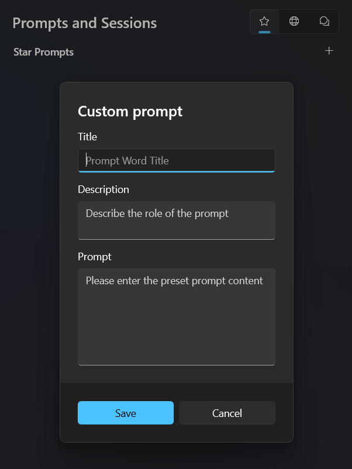
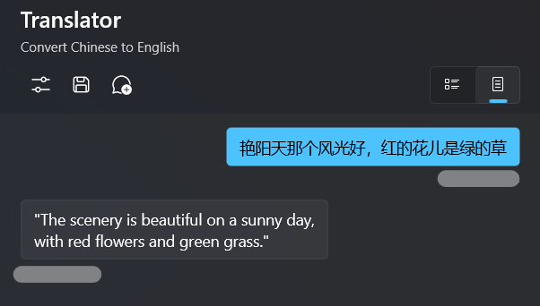
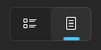
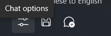
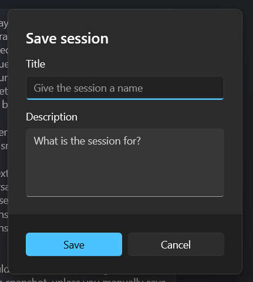
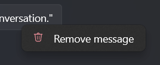

Regarding how to write a good prompt, there is a lot of information available online, so I won't waste time repeating it in this document. This document mainly discusses how to use Fantasy Copilot to manage prompts and session records, as well as some common operations.

## Prompts

You can use the built-in simple prompt management tool in the application. On the "Prompts and Sessions" page, you can click the "Add" button under the "Star Prompts" tab to create a preset prompt.



This is an example:

```yaml
Title: Translator
Description: Convert Chinese to English
Prompt: You are a translation expert and you translate everything I say into English.
```

After creating it, click on "Save" and you will see the item you just created appear in the list. 

Click on this prompt and you can create a new session. 

The prompt you wrote will be communicated to the AI assistant as `<|system|>` to inform it of its responsibilities.



### Prompt Library

Prompt is a very interesting topic, and there are always a lot of fresh prompts emerging in the community every day.

Fantasy Copilot has a built-in online prompt library, which you can access by clicking on `Prompt Library`. 

The requested data will be cached locally until you manually refresh it. 

You can directly click on a prompt to quickly create a session. 

You can also right-click on an item, select "Favorite", and then edit it in "Star Prompts". Alternatively, you can simply copy the prompt to the clipboard.


## Sessions

The `Session` indicates the context in which you are currently communicating with the AI assistant.

### Conversation Modes

Fantasy Copilot offers two conversation modes:



- Continuous Conversation
- Single Conversation

When you choose `Continuous Conversation`, you will chat with the AI assistant just like you would with a human. The context of your conversation will be preserved throughout the session lifecycle, and the AI assistant will remember the context until it reaches the model's token limit.

When you choose `Single Conversation`, any new questions you ask will clear the previous chat history. However, if you have preset prompts, the prompts will still be retained. This is useful for scenarios where you want to test the performance of prompt words.

### Chat Options

In the conversation, you can adjust the performance of the model through some parameters. Please click on the `Chat options` in the top menu of the conversation panel, and you can adjust various parameters there. 



Although I have written a brief explanation for each parameter, it may still be difficult to understand if you are not familiar with the underlying principles. 

Here is a more detailed introduction. If you are still confused about any of the parameters, please look up relevant explanations for further clarification.

|Parameter|Decription|
|-|-|
|Maximum Output Tokens|The maximum number of tokens to generate in the completion. The token count of your prompt plus max_tokens can't exceed the model's context length. Most models have a context length of 2048 tokens (except davinci-codex, which supports 4096).|
|Top-P|An alternative to sampling with temperature, called nucleus sampling, where the model considers the results of the tokens with top_p probability mass. So 0.1 means only the tokens comprising the top 10% probability mass are considered. We generally recommend altering this or temperature but not both.|
|Temperature|What sampling temperature to use. Higher values means the model will take more risks. Try 0.9 for more creative applications, and 0 (argmax sampling) for ones with a well-defined answer. We generally recommend altering this or `top-p` but not both.|
|Frequency Penalty|Number between -2.0 and 2.0. Positive values penalize new tokens based on their existing frequency in the text so far, decreasing the model's likelihood to repeat the same line verbatim.|
|Presence Penalty|Number between -2.0 and 2.0. Positive values penalize new tokens based on whether they appear in the text so far, increasing the model's likelihood to talk about new topics.|

### Save Session

You may have made some adjustments to the parameters of the conversation and validated them through a few rounds of dialogue. If you want to keep the current configuration (including preset prompt, parameters, and context), you can click the `Save` button in the top menu. 

By entering a title and description, you will save a snapshot of the current session. 



The next time you want to continue this conversation, you can find the previously saved session snapshot in the "Saved Sessions" section of the "Prompts and Sessions" module by clicking on the top menu. 

It should be noted that when you enter a session snapshot, unless you manually save it, new chat records will not be saved to the current snapshot.

### Operations during the conversation

**Remove message**

You can right-click on a message and directly delete it from the chat history, which can help you with some debugging.



**Clear chat history**

When you are having a continuous conversation, you can click on the `Clear the chat history` button at the top to directly clear the current chat history. However, the preset prompts are not included in the clear range.

**Create new session**

If you are not prepared to continue the current conversation, you can click the `New session` button at the top to create a new blank session directly.