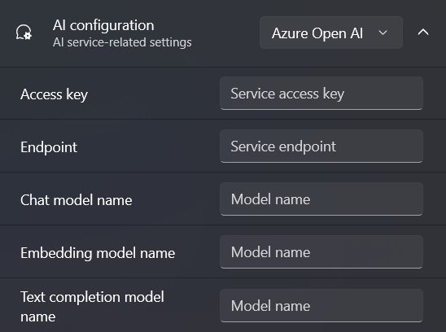
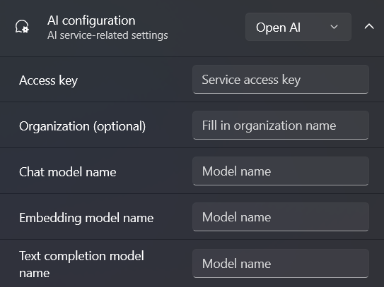
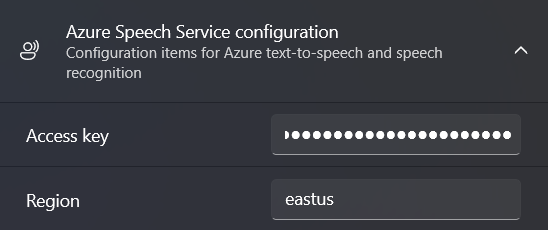
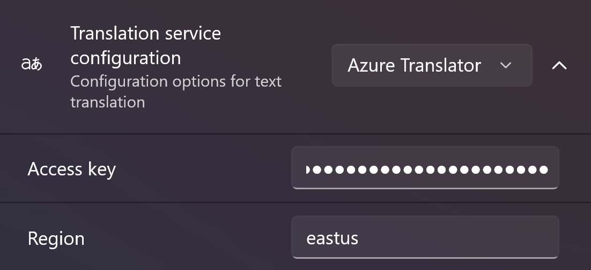
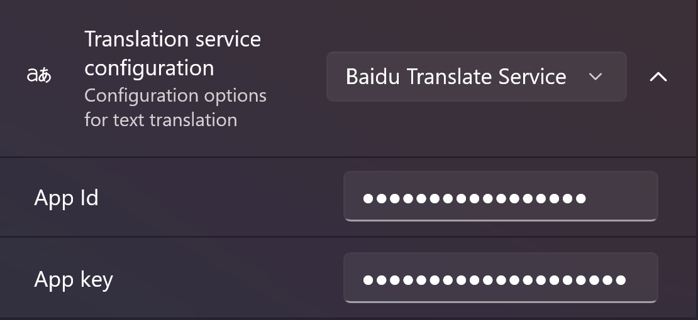
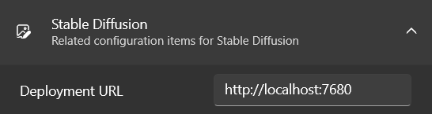

If you want to experience the full functionality of Fantasy Copilot, you need to have the following services:

- Azure Open AI or Open AI
- Azure Speech Service
- Azure Translator
- Everything
- Stable Diffusion

The configuration of the services is not complicated, and this document will introduce the configuration of the above services one by one.

## AI

Azure Open AI is closely related to Open AI as it is a service deployed on Azure through a collaboration between Microsoft and Open AI. Therefore, the user experience of both services is similar.

> The `Chat` and `Text Completion` models are complementary. You can fill in only one of them, or both. When chating, use the Chat model first (such as gpt-3.5-turbo)

### Azure Open AI

Assuming that you already have Azure Open AI service deployed. If you haven't deployed Azure Open AI yet, please refer to this documentation:[How to access Azure Open AI](https://learn.microsoft.com/azure/cognitive-services/openai/overview#how-do-i-get-access-to-azure-openai)

In the application configuration interface (first launch or settings page), switch the AI configuration to **Azure Open AI** and expand the settings section.

In your Azure portal, open the deployed Open AI service and switch to "Keys and Endpoints". Copy the key and endpoint and paste them into the `Access key` and `Endpoint` fields.

In model deployment, please fill in the names of the models you deployed according to their types, respectively in `Chat`, `Embedding`, and `Text completion`.

Regarding the types of deployable models in Azure Open AI, you can refer to this document:[Azure OpenAI Service models](https://learn.microsoft.com/azure/cognitive-services/openai/concepts/models)

After filling out the form, switch to the "New session" module in the bottom navigation bar, and you will be able to see that the chat service is available.

### Open AI

Assuming that you already have an Open AI account and have a valid API key. The API key can be created in the [Open AI Platform](https://platform.openai.com/).

In the application configuration interface (first launch or settings page), switch the AI configuration to Open AI and expand the settings section.

Please fill in your Open AI key in the `Access key` field. Typically, for personal accounts, the organization type is `Personal`, so you do not need to fill in the `Organization` field. However, if you have a specific organization, please fill in this field.

Take the models you have and categorize them into `Chat`, `Embedding`, and `Text completion`. A general example would be:

|Field|Model name|
|-|-|
|Chat|gpt-3.5-turbo|
|Embedding|text-embedding-ada-002|
|Text completion|text-davinci-003|

Regarding the model list in Open AI, you can refer to this document:[Open AI Models](https://platform.openai.com/docs/models/overview)

After filling out the form, switch to the "New session" module in the bottom navigation bar, and you will be able to see that the chat service is available.

## Azure Speech Service

Like most Azure services, If you haven't created a voice service yet, please click on this link: [Create a Speech resource](https://portal.azure.com/#create/Microsoft.CognitiveServicesSpeechServices).

Then, in the "Keys and Endpoint" section, copy the values of the `Key` and `Location/Region` to their corresponding settings.

## Azure Translator

If you don't have Azure Translator service yet, please refer to this documentation: [Create a Translator resource](https://learn.microsoft.com/en-us/azure/cognitive-services/Translator/create-translator-resource) to create the service.

Then, in the "Keys and Endpoint" section, copy the values of the `Key` and `Location/Region` to their corresponding settings.

## Baidu Translate

To use Baidu Translate, the following steps need to be taken (if you already have a developer account on Baidu Translate Open Platform, please skip to step 4):

1. Open the [Baidu Translate Open Platform](http://api.fanyi.baidu.com/).
2. Log in or register for an account.
3. Access the console.
4. Click on "Developer Information" and copy the "APP ID" and "Key" into the corresponding settings of your application.

## Everything

The application integrates **Everything** to provide you with a modern interface for file search, but the prerequisite is that Everything needs to be installed on your device.

If you haven't installed the application yet, please download and install it from [voidtools](https://www.voidtools.com/).

Once the installation is complete, the `File Search` service of Fantasy Copilot will be immediately available.

It should be noted that if you are using the portable version, you must manually start Everything.

## Stable Diffusion

Fantasy Copilot interacts with Stable Diffusion through an API, so if you want to call Stable Diffusion drawing in the application, you need to meet the following requirements:

1. The device has installed [AUTOMATIC1111/stable-diffusion-webui](https://github.com/AUTOMATIC1111/stable-diffusion-webui).
2. The WebUI service has started and the API option is enabled.

If your Stable Diffusion is deployed on a server, make sure that Stable Diffusion is running and you can access it through the API.

Whether Stable Diffusion is deployed locally or on a server, simply fill in the corresponding URL in the `Deployment URL`.

