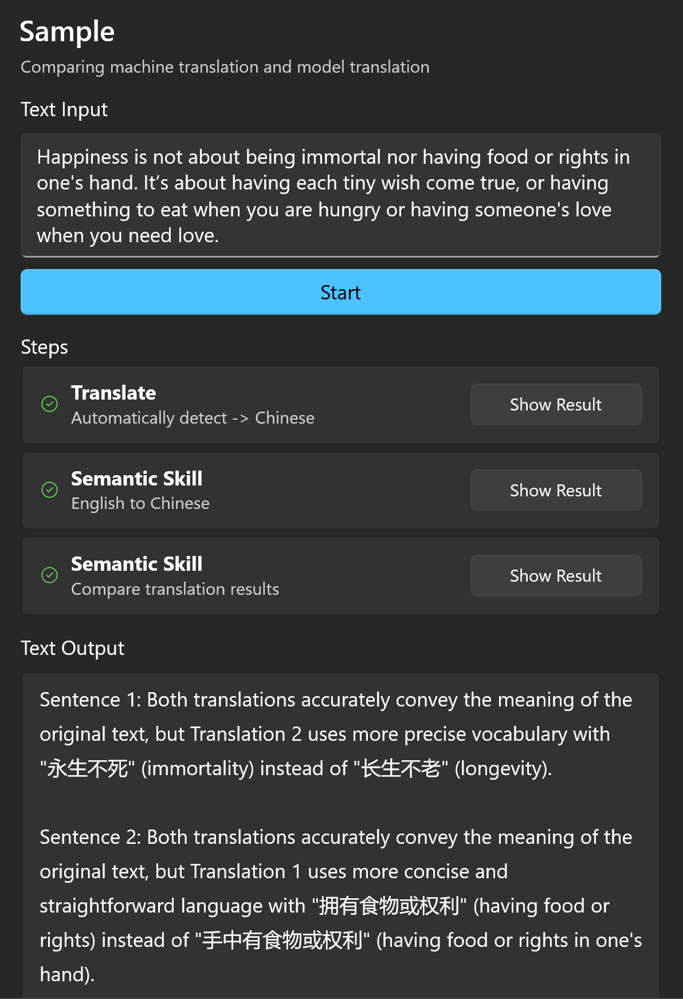

## What is a workflow?

The workflow of Fantasy Copilot is a solution that combines the execution code and model Q&A through Semantic Kernel to form an automated path.

The workflow is linear and currently does not support branching, such as conditional statements or loops. It primarily uses text as input and output.

Each step in the workflow receives text input from the previous step and outputs text as input for the next step.

## Context

In order to meet diverse input requirements, the workflow includes a local context that contains several variables. Each step can write to or read from the current variables in the context.

If a step requires a variable provided by another step, there is a dependency between them, and the order of these steps needs to be carefully considered.

## Common variables

|Name|Description|
|-|-|
|{{$ORIGINAL}}|Retrieve initial input content.|
|{{$INPUT}}|Standard variable used to retrieve the output content from the previous step.|
|{{$STEP_RESULT_i}}|To obtain the result of a specified step, `i` represents the step number, starting from **0**. If you want to obtain the result of the second step, you can use `{{$STEPRESULT_1}}` in the third step or any subsequent steps. |
|{{$TEXT_TO_IMAGE_i}}|To obtain the image metadata information for the step in the document generation process, where `i` represents the step's sequence number in the overall task queue.|
|{{$KNOWLEDGE_SOURCE_i}}|The source of knowledge for retrieving information from the knowledge base for question answering (usually in the form of a file name), where `i` is the step number of the knowledge base question answering process in the overall task queue.|

## Sample

The purpose of this workflow is simple: we input a piece of text, then use machine translation first, followed by GPT translation, and finally let GPT compare the two translation results and give an evaluation.

### Creating semantic skills

In the following example, we will create two semantic skills and use the variables we mentioned earlier in the prompt template.

**1. Translation content**

```yaml
title: English to Chinese
description: Input English and translate it into Chinese output
```
*Prompt*

```
I will give you some content, please help me translate into Chinese.

--- CONTENT ---
{{$ORIGINAL}}
--- END CONTENT ---
```

In the above prompt, we used the {{$ORIGINAL}} variable to ensure that we are retrieving the user's original input.

**2. Comparative translation**

```yaml
title: Compare translation results
description: Compare the results of machine translation and model translation, and give a detailed evaluation
maxResponseToken: 1000
```

*Prompt*

```
I will give you the original text and two translated results.

Please analyze the pros and cons of the two translations sentence by sentence against the original text, and give a final score.

--- ORIGINAL ---
{{$ORIGINAL}}
--- END ORIGINAL ---

--- TRANSLATION 1 ---
{{$STEPRESULT_0}}
--- END TRANSLATION 1 ---

--- TRANSLATION 2 ---
{{$INPUT}}
--- END TRANSLATION 2 ---
```

### Build workflow

```yaml
title: Sample
description: Comparing machine translation and model translation
steps:
  - input: Text input
  - steps:
    - Translate: En -> Zh
    - Semantic skill: English to Chinese
    - Semantic skill: Compare translation results
  - output: Text output
```

**Sample text**

```
Happiness is not about being immortal nor having food or rights in one's hand. It’s about having each tiny wish come true, or having something to eat when you are hungry or having someone's love when you need love.
```

**Screenshot**



## Keep doing something...

### Insipre me

The power of an automation tool depends on the richness of its commands. However, having a wide range of commands can also result in a high learning curve, making it difficult for beginners to build complex workflows in a short amount of time.

Fantasy Copilot aims to lower this barrier to entry.

When building a workflow, I recommend describing what you want to achieve in the `Goal` section first. As you describe it, you will see a button appear in the bottom right corner of the interface.

Clicking it will prompt the application to automatically arrange a task chain for you by selecting a path from your existing command library that can achieve your goal.

### Expanding application capabilities

The application comes with a set of built-in commands that are part of the Fantasy Copilot app. Additionally, the app supports the use of plugins to expand the command library.

You can either write your own plugins or reference others' plugins to enrich your command library.

Try freely combining them in your workflow!

*If you're interested in learning how to write plugins, you can refer to [[Create Plugins]].*